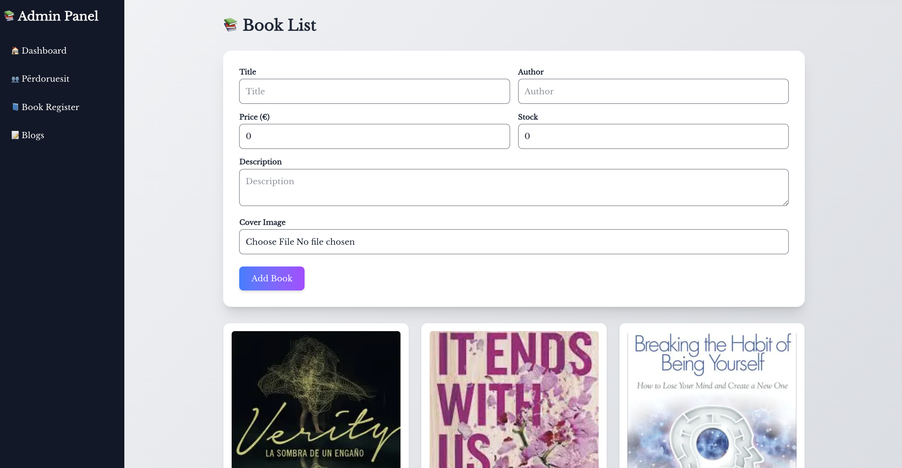
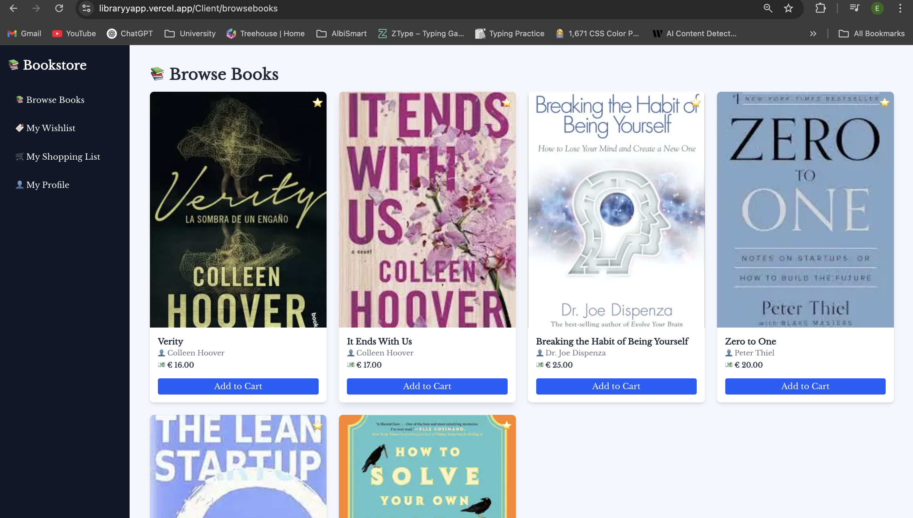

# 📚 LibraryyApp – Online Bookstore Platform

[LibraryyApp](https://libraryyapp.vercel.app) is a modern online bookstore platform built with Next.js, TailwindCSS, and MongoDB.  
Its goal is to provide users with a simple and intuitive experience for exploring recommended books, reading blog articles, and contacting the store.

---

## 🚀 Main Features

- Hero and About sections for platform introduction  
- Recommended Books and Weekly Offers  
- Blog section manageable by the admin panel  
- Contact form for user inquiries  
- Authentication with Google, Facebook, and credentials (NextAuth.js)  
- Admin dashboard to manage blogs and users  
- Role-based access control for admin and clients  

---

## 📦 Technologies & Dependencies

This project is built using the following technologies and libraries:

- **Next.js 15** – React framework for fast and scalable applications  
- **React 19** – Library for building user interfaces  
- **Tailwind CSS 4** – Utility-first CSS framework  
- **MUI (Material UI 7)** – Advanced UI component library  
- **NextAuth.js** – Authentication with Google, Facebook, and credentials  
- **Mongoose 8** – ODM for MongoDB  
- **Zustand** – Lightweight state management  
- **Framer Motion** – Powerful animations for React  
- **React Hook Form** – Form state and validation management  
- **React Hot Toast** – Beautiful and fast toast notifications  
- **Lucide React & React Icons** – Icon libraries  
- **bcryptjs** – Password hashing  
- **dotenv** – Environment variable management  
- **formidable** – File upload handling  

### 🧪 Development & Testing

- **Jest** and **Testing Library** – Unit testing for React components  
- **ESLint** – Code style and quality enforcement  
- **TypeScript** – Static typing (optional)  
- **PostCSS** – Plugin support for Tailwind  

---

## 🛠️ Installation Guide

1. **Clone the repository:**
   ```bash
   git clone https://github.com/EraGashii/_Library.git
   cd nextjs-dashboard

npm run dev
Open http://localhost:3000 in your browser.

🔗 Live Demo & Screenshots
🌐 Live Application:
https://libraryyapp.vercel.app

## 📸 Screenshots

**✅ Admin Panel**  


**🏠 Homepage**  


**👤 Client Panel**  



👥 Project Contributors
Name	Role
Era Gashi	Frontend, Authentication, Dashboard, Docs
Driard Shala	Frontend, Authentication, Dashboard, Docs

